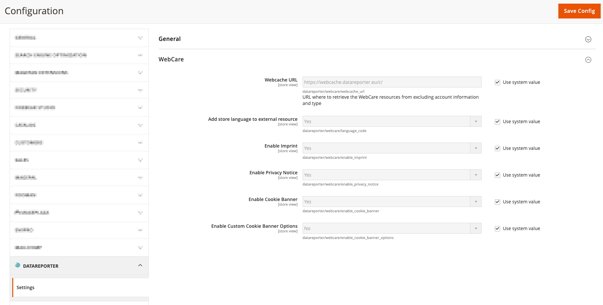
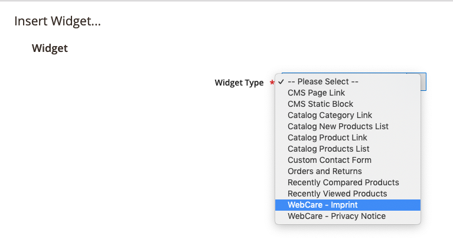

DataReporter WebCare Magento2 Module
============
 
 
 

Magento2 module to embed DataReporter WebCare elements (imprint, privacy notice, cookie banner)

Installation
------------

The easiest way to install the extension is to use [Composer](https://getcomposer.org/).

Run the following commands:

- ```$ composer require datareporter/module-webcare```
- ```$ bin/magento module:enable DataReporter_Core``` (if not already installed and enabled)
- ```$ bin/magento module:enable DataReporter_WebCare```
- ```$ bin/magento setup:upgrade && bin/magento setup:static-content:deploy```

Features
------------

###Imprint
Use class ````\DataReporter\WebCare\Block\ImprintBlock```` or embedd into CMS-Page/Block as Widget named 'WebCare - Imprint'

###Privacy Notice
Use class ````\DataReporter\WebCare\Block\PrivacyNoticeBlock```` or embedd into CMS-Page/Block as Widget named 'WebCare - Privacy Notice'

###Cookie Banner
All needed blocks are placed within the layout-xml ```default.xml```. 

If you need to add correct cookie handling if something was denied or allowed, contrubte a js content to the container

```datareporter.webcare.cookiebanner.allow-handling``` or ```datareporter.webcare.cookiebanner.allow-handling```

####Configuration

* URL for the Webcache-Server, normally this is https://webcache.datareporter.eu/c/ if the DataReporter-Suite is not self hosted
* Add Store configured language to the resource calls to override any other default language settings in DataReporter
* En-/Disabling of the Imprint-, Privacy Notice- and Cookie-Banner-Block to seperatelly controll if they are used



####Example

* Widget selection within a CMS-Page/Block:



* Enhancing cookiebanner functions:

Create your own module or adapt your themes ```default.xml``` and add following block instruction:

```
<referenceContainer name="datareporter.webcare.cookiebanner.allow-handling">
    <block name="test-cookiebanner-allow" class="Magento\Framework\View\Element\Template" template="cookiebanner/test.phtml"/>
</referenceContainer>
<referenceContainer name="datareporter.webcare.cookiebanner.deny-handling">
    <block name="test-cookiebanner-deny" class="Magento\Framework\View\Element\Template" template="cookiebanner/test.phtml"/>
</referenceContainer>
``` 

Content of ```test.phtml```:
```
console.log('current status for cookies('+chosenBefore+'): '+status);
```

This will output the status of the cookie banner user interaction and all according actions and adaptions can be made to comply with the GDPR according to cookies

#####Demo

Use following Demo-Credentials if you wanna try out the module, see ````Privacy -> Configuration````

* Client-Id: 33f002cc-2586-42b6-987d-548b2953c7b8
* Organisation-Id: R5spy6ZYDqA